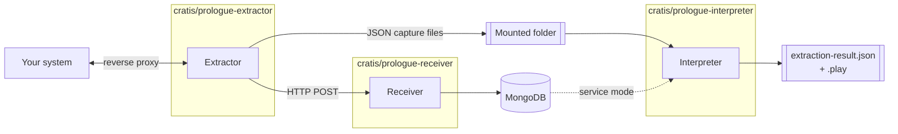
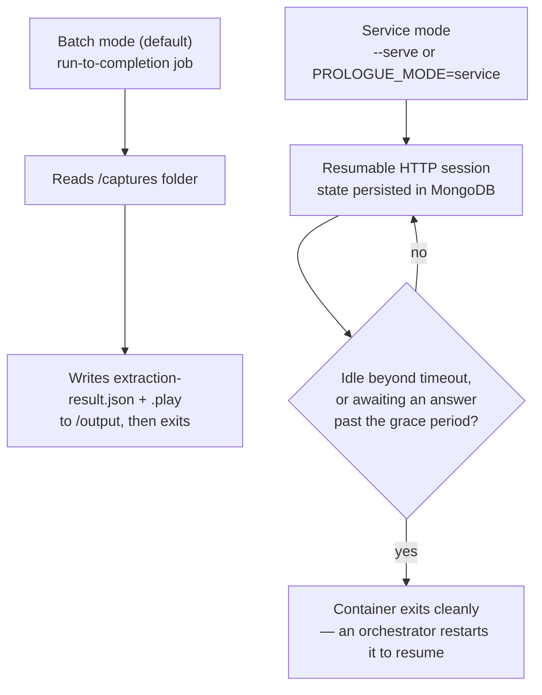

Prologue is deliberately self-contained. Every other Cratis product either runs inside an Orleans silo (Chronicle) or is a library you reference from one (Arc, Components). Prologue is neither — it's three ordinary containers (or a downloadable binary, for the Extractor) that read and write plain files and HTTP, so it can stand next to *any* system, Cratis-based or not, without pulling in a hosting model of its own.

## The pieces

- **Extractor** — a reverse proxy plus a database and telemetry watcher, all in one process. It's the only piece that has to run continuously, next to the system it's watching.
- **Receiver** — a thin HTTP endpoint (`POST /captures`, `POST /prologues/{id}/captures`) that stores whatever the Extractor posts to it in MongoDB via `Cratis.Prologue.Storage`. It's optional — the Extractor can write JSON files to a mounted folder instead, with no Receiver or MongoDB involved at all.
- **Interpreter** — a job, not a service, by default. It reads a folder of capture files, interprets them, and exits. A second mode keeps it running as a resumable HTTP session backed by MongoDB, for Studio's interactive review flow.

The shared `Cratis.Prologue.Contracts`, `Cratis.Prologue.Configuration`, and `Cratis.Prologue.Interpreter.Contracts` NuGet packages give all three tools (and any consumer, like Studio) one canonical shape for captures, configuration, and the extraction result — nobody hand-parses another tool's output format.

## Two ways to run the Interpreter

**Batch mode** is what you get from the image by default, and what the [Cratis CLI](/cli/reference/prologue/)'s `cratis prologue interpret` drives — a folder of captures in, an `ExtractionResult` and a Screenplay `.play` file out, then the container exits. See [Running the Interpreter](guides/running-the-interpreter.md).

**Service mode** hosts the same interpretation logic as a resumable session over HTTP, with session state persisted in MongoDB rather than kept in memory — so a long-running interpretation (one that's waiting on you to answer an LLM's clarifying question, for instance) survives the container being recycled. This is the mode Studio drives; if you're not integrating with Studio, batch mode is what you want.

## No dependency on Studio

Nothing here requires Studio to be running, and nothing in Studio requires Prologue — Studio simply happens to be a good consumer of the `ExtractionResult`/MongoDB shape when you want to review and reshape a model visually before running it. If you only want a `.play` file, the Extractor and the batch Interpreter are the whole pipeline; the [Cratis CLI](/cli/reference/prologue/) is the most convenient way to drive them.

## Next

- **[Point Prologue at your system](guides/point-prologue-at-your-system.md)** — wiring the Extractor up to something real.
- **[Reference — Configuration](reference/configuration.md)** — every `cratis-prologue.json` property.
