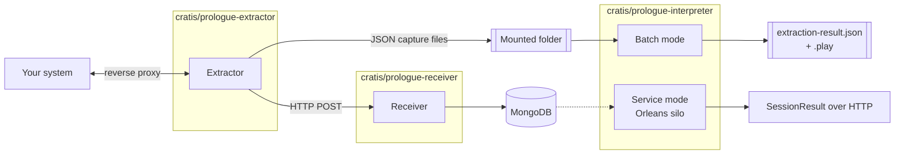
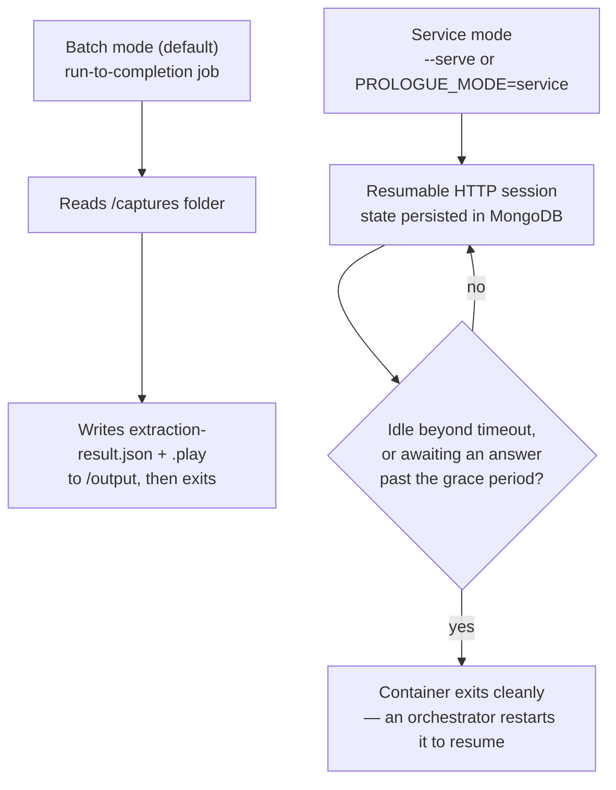

Prologue is deliberately self-contained and has no dependency on Studio. The Extractor and Receiver are ordinary
services, while the Interpreter supports two hosting shapes: a run-to-completion batch process and a resumable
HTTP service. Only the resumable service mode embeds an Orleans silo; file-based capture and batch interpretation
do not require Orleans.

## The pieces

- **Extractor** — a reverse proxy plus a database and telemetry watcher, all in one process. It's the only piece that has to run continuously, next to the system it's watching.
- **Receiver** — a thin HTTP endpoint (`POST /captures`, `POST /prologues/{id}/captures`) that stores whatever the Extractor posts to it in MongoDB via `Cratis.Prologue.Storage`. It's optional — the Extractor can write JSON files to a mounted folder instead, with no Receiver or MongoDB involved at all.
- **Interpreter** — a job, not a service, by default. It reads a folder of capture files, interprets them, and exits. A second mode embeds Orleans and keeps interpretation running as resumable session grains with state backed by MongoDB.

The shared `Cratis.Prologue.Contracts`, `Cratis.Prologue.Configuration`, and
`Cratis.Prologue.Interpreter.Contracts` packages define the canonical capture, configuration, and extraction-result
formats. `Cratis.Prologue.Interpretation` contains the interpretation engine, and `Cratis.Prologue.Screenplay`
converts an extraction result into a `.play` document.

## Two ways to run the Interpreter

**Batch mode** is what you get from the image by default, and what the [Cratis CLI](/cli/reference/prologue/)'s `cratis prologue interpret` drives — a folder of captures in, an `ExtractionResult` and a Screenplay `.play` file out, then the container exits. See [Running the Interpreter](guides/running-the-interpreter.md).

**Service mode** embeds an Orleans silo and hosts interpretation as resumable session grains over HTTP. Session
state persists in MongoDB, so a session waiting for answers can resume after the process restarts. This mode is
intended for interactive integrations; use batch mode when you only need file-based input and output.

## No dependency on Studio

Nothing here requires Studio to be running. If you only want an `ExtractionResult` and `.play` file, the Extractor
and batch Interpreter are the complete Prologue pipeline; the [Cratis CLI](/cli/reference/prologue/) provides the
corresponding command workflow.

## Next

- **[Point Prologue at your system](guides/point-prologue-at-your-system.md)** — wiring the Extractor up to something real.
- **[Reference — Configuration](reference/configuration.md)** — every `cratis-prologue.json` property.
