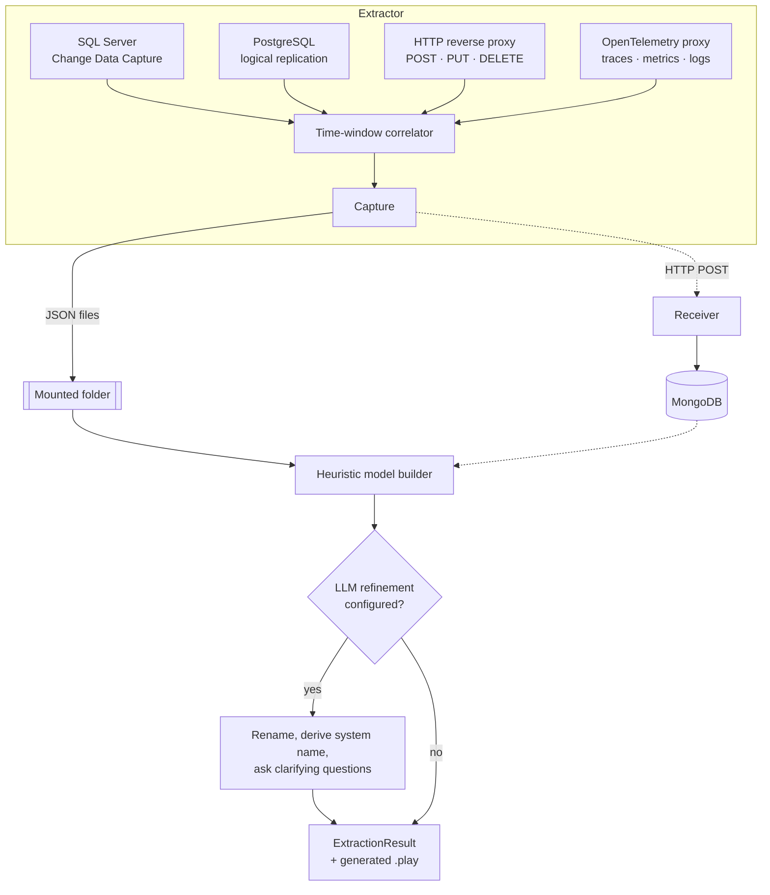

Prologue's job splits into three stages that run as two separate tools: the **Extractor** watches and correlates, the **Interpreter** reads the result and builds the model.

## What each capture source watches

- **SQL Server** — change data capture. The Extractor enables CDC on the database itself (you don't need to); an optional table allowlist narrows which tables it watches, otherwise it captures every user table's changes.
- **PostgreSQL** — logical replication. The Extractor creates its own publication and replication slot on the configured database — nothing to prepare on the database side beyond `wal_level = logical`.
- **HTTP** — a YARP reverse proxy sits in front of the system. It captures only state-changing methods (`POST`, `PUT`, `DELETE`) — method, path, response status, and the W3C `traceparent` trace id if one's present — and forwards the request through unchanged. `GET` and other read traffic is invisible to Prologue by design; reads don't produce facts to model.
- **OpenTelemetry** — an OTLP proxy. It captures span, metric, and log metadata — service name and an allowlisted set of attribute keys, never full payloads — and forwards everything on to wherever your telemetry already goes, so nothing about your observability stack changes.

Every source captures **metadata, not data** — see [Why Prologue](why-prologue.md#what-prologue-captures--and-doesnt) for why that boundary is deliberate.

## How captures get correlated

A single command rarely tells the whole story on its own — the interesting fact is usually the command *and* the database transactions it caused. The Extractor's correlator groups observations within a configurable time window (`correlation.windowMilliseconds`, 2000ms by default) into one **capture**:

- An HTTP command plus every database transaction, telemetry span, or log observed within `[command occurred, command occurred + window]` — or that shares the command's trace id — becomes one capture. The command and its effects are read together.
- Telemetry that carries a trace id but has no preceding command of its own groups into one capture per trace id — useful for background work that never went through the reverse proxy.
- Everything else — a standalone database transaction, a bare metric — becomes its own capture.
- A database *schema* change (a table or column appearing or disappearing) is recorded but is never itself evidence that groups other observations together — schema drift isn't a business fact.

The correlator only emits a capture once nothing newer than the window could still join it — so a capture is never split across two runs just because the window hadn't closed yet.

## From captures to an event model

The Interpreter reads back whichever captures it's pointed at — a folder of JSON files (batch mode) or MongoDB (service mode, for Studio) — and reconstructs them into an `ExtractionResult`: modules, features, and slices, each carrying the commands, events, read models, projections, and constraints the heuristics inferred from the evidence. See [The extraction result](reference/extraction-result.md) for the exact shape.

Heuristics alone get you a structurally correct model with mechanical names. Point the `llm` section of `cratis-prologue.json` at a language model — Ollama, OpenAI, Azure OpenAI, any OpenAI-compatible endpoint, or Anthropic — and the Interpreter refines that structure into domain language: renaming commands, events, and read models, deriving a system name, and, when it's genuinely uncertain about a decision that would materially change the model, asking you a clarifying question rather than guessing silently.

## Next

- **[Architecture](architecture.md)** — how the Extractor, Interpreter, and Receiver deploy and compose.
- **[Reference — Capture sources](reference/capture-sources.md)** — every configuration property per source.
- **[Reference — Configuration](reference/configuration.md)** — the full `cratis-prologue.json` schema, including the `llm` section.
