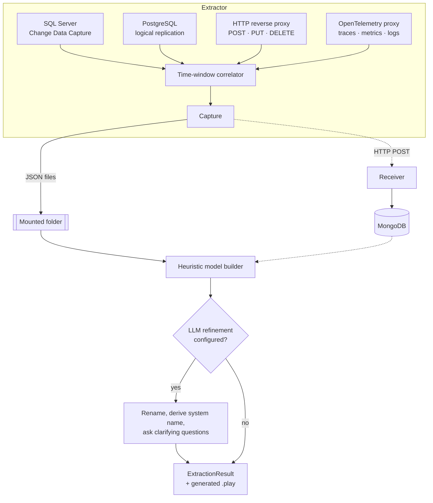

Prologue's job splits into three stages that run as two separate tools: the **Extractor** watches and correlates, the **Interpreter** reads the result and builds the model.

## What each capture source watches

- **SQL Server** — change data capture. The Extractor enables CDC on the database itself (you don't need to); an optional table allowlist narrows which tables it watches, otherwise it captures every user table's changes.
- **PostgreSQL** — logical replication. The Extractor creates its own publication and replication slot on the configured database — nothing to prepare on the database side beyond `wal_level = logical`.
- **HTTP** — a YARP reverse proxy sits in front of the system. It captures only state-changing methods (`POST`, `PUT`, `DELETE`) — method, path including query string, response status, and the W3C `traceparent` trace id if one's present — and forwards the request through unchanged. `GET` and other read traffic is invisible to Prologue.
- **OpenTelemetry** — an OTLP proxy. It retains span, metric, and log names and identifiers, every observed attribute key, and values only for explicitly allowlisted attribute keys. Log bodies and metric measurements are dropped. It can forward the original telemetry to an upstream collector when configured.

Database row values and HTTP bodies are excluded, but capture output can still contain sensitive metadata such as
query strings, identifiers, operation names, and allowlisted telemetry values. Minimize the configuration and
protect the resulting captures. See [Why Prologue](why-prologue.md#what-prologue-captures--and-doesnt) for the
boundary.

## How captures get correlated

A single command rarely tells the whole story on its own. The Extractor therefore uses a configurable time window
(`correlation.windowMilliseconds`, 2000ms by default) and trace identifiers to associate observations into one
**capture**:

- An HTTP command claims currently unclaimed database transactions, spans, metrics, and logs observed between the
  command timestamp and the end of its window.
- Spans and logs that share the command's trace id can join it even when their timestamps fall outside the window.
  Database transactions and metrics do not carry trace identifiers in the current contract and associate by time.
- Settled spans and logs without a command group by trace id. A later drain can produce another capture for the
  same long-running trace.
- Other settled observations, including standalone database transactions, metrics, and the schema captured when a
  database source starts, become individual captures.

Normal periodic drains wait for observations to settle beyond the configured window. Pending observations remain
in process memory, so this is a correlation heuristic rather than a cross-process losslessness guarantee.

## From captures to an event model

The Interpreter reads a folder of JSON files in batch mode or MongoDB in service mode and analyzes the captures
to propose an `ExtractionResult`: modules, features, and slices carrying candidate commands, events, read models,
projections, and constraints. See [The extraction result](reference/extraction-result.md) for the exact shape.

Heuristics produce a provisional model with mechanical names that must be reviewed. Point the `llm` section of
`cratis-prologue.json` at Ollama, OpenAI, Azure OpenAI, an OpenAI-compatible endpoint, or Anthropic to refine names
and descriptions, derive a system name, and ask bounded clarification questions in service mode. Language-model
refinement does not turn observed implementation evidence into accepted domain truth.

## Next

- **[Architecture](architecture.md)** — how the Extractor, Interpreter, and Receiver deploy and compose.
- **[Reference — Capture sources](reference/capture-sources.md)** — every configuration property per source.
- **[Reference — Configuration](reference/configuration.md)** — the full `cratis-prologue.json` schema, including the `llm` section.
