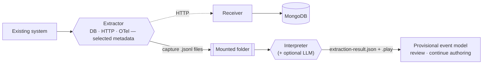

## The system nobody fully understands anymore

Somewhere in every organization there's a system like this: it works, it matters, and nobody left on the team can say with confidence what it actually does under load. The people who built it have moved on. The wiki page is three reorganizations out of date. Rewriting it as an event-sourced Cratis application would be the right long-term move, but the first step — figuring out what to model — usually means weeks of archaeology: reading code nobody trusts, interviewing whoever's left, and guessing at the rest.

Prologue gives you another source of evidence. It stands beside the running system, observes selected HTTP
commands, database changes, and telemetry, and proposes a structured event model: modules, features, and slices
with candidate commands, events, read models, and projections. You review and correct that proposal rather than
treating observed implementation behavior as recovered domain intent.

Prologue does not capture database row values or HTTP bodies. Its metadata can still be sensitive: HTTP
observations include query strings, telemetry includes identifiers and names, and explicitly allowlisted
OpenTelemetry attributes include their values. Minimize the capture configuration and protect the resulting
files and persisted observations.

## How it fits together

The **Extractor** watches the system through database change capture, an HTTP reverse proxy, and an OpenTelemetry
proxy. It correlates observations into **captures** using trace identifiers where available and a time window
otherwise. It writes captures to a mounted folder or posts them to the **Receiver**, which stores them in MongoDB.
The **Interpreter** analyzes those captures heuristically, can optionally refine names and descriptions with a
language model, and produces an `ExtractionResult` plus a generated [Screenplay](/screenplay/) `.play` file.

Prologue has no dependency on Studio. The Extractor, Receiver, and batch Interpreter run without Orleans. The
Interpreter's optional resumable service mode embeds an Orleans silo for persisted interpretation sessions.

## The cast

| Piece | What it is | Ships as |
|---|---|---|
| Extractor | Watches the system: SQL Server CDC, Postgres logical replication, an HTTP reverse proxy, and an OTLP proxy | `cratis/prologue-extractor` (Docker) |
| Interpreter | Reads captures and interprets them into an event model and a Screenplay | `cratis/prologue-interpreter` (Docker) |
| Receiver | An HTTP endpoint the Extractor can post captures to directly, storing them in MongoDB | `cratis/prologue-receiver` (Docker) |
| `Cratis.Prologue.Contracts` | The capture contract and canonical JSON/capture-file formats | NuGet |
| `Cratis.Prologue.Configuration` | Typed `cratis-prologue.json` configuration for the Extractor and Interpreter | NuGet |
| `Cratis.Prologue.Storage` | MongoDB persistence for captures, used by the Receiver and by Studio | NuGet |
| `Cratis.Prologue.Interpreter.Contracts` | The `ExtractionResult` contract | NuGet |
| `Cratis.Prologue.Interpretation` | Heuristic construction and optional language-model refinement | NuGet |
| `Cratis.Prologue.Screenplay` | Conversion from an extraction result to a `.play` document | NuGet |

See [Architecture](architecture.md) for how these pieces compose and deploy.

## Get started

1. **[Getting started](getting-started.md)** — run the bundled sample system, watch Prologue capture it end to end, then turn a folder of captures into a `.play` file you can run.
2. **[Why Prologue](why-prologue.md)** — the problem it solves, and when it's the wrong tool for the job.
3. **[How Prologue works](concepts.md)** — the capture, correlation, and interpretation pipeline in depth.
4. **[Point Prologue at your system](guides/point-prologue-at-your-system.md)** — the practical checklist for your own system, not the sample.

Prefer driving it from a terminal? The [Cratis CLI](/cli/reference/prologue/) wraps the wizard and the Interpreter in two commands: `cratis prologue start` and `cratis prologue interpret`.
