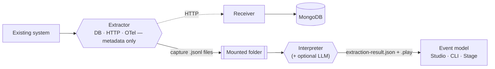

## The system nobody fully understands anymore

Somewhere in every organization there's a system like this: it works, it matters, and nobody left on the team can say with confidence what it actually does under load. The people who built it have moved on. The wiki page is three reorganizations out of date. Rewriting it as an event-sourced Cratis application would be the right long-term move, but the first step — figuring out what to model — usually means weeks of archaeology: reading code nobody trusts, interviewing whoever's left, and guessing at the rest.

Prologue skips the archaeology. It stands beside the running system, watches what it *actually does* — the HTTP commands that change state, the database rows that change alongside them, the telemetry the system already emits — and hands you back a structured event model: modules, features, and slices with their commands, events, read models, and projections. Not a guess. Evidence.

It captures **metadata, not data** — which tables and columns changed, which endpoints were called, which spans fired — never the actual values. The story, not anyone's private lines.

## How it fits together

The **Extractor** watches the system from three angles at once — database change capture, an HTTP reverse proxy, and an OpenTelemetry proxy — and correlates what it sees into **captures**: a command plus the database transactions committed in the same window, read as one act. It writes those captures to a mounted folder as it goes, or posts them straight to the **Receiver**, which stores them in MongoDB. Either way, the **Interpreter** reads the captures back — heuristically at first, then optionally refined by a language model — and reconstructs them into an `ExtractionResult`: the event model, plus a generated [Screenplay](/screenplay/) `.play` file ready to run.

Prologue is self-contained. It has no dependency on Studio and doesn't require Orleans or any other hosting model — everything runs as a downloadable CLI extractor or as three plain containers.

## The cast

| Piece | What it is | Ships as |
|---|---|---|
| Extractor | Watches the system: SQL Server CDC, Postgres logical replication, an HTTP reverse proxy, and an OTLP proxy | `cratis/prologue-extractor` (Docker) |
| Interpreter | Reads captures and interprets them into an event model and a Screenplay | `cratis/prologue-interpreter` (Docker) |
| Receiver | An HTTP endpoint the Extractor can post captures to directly, storing them in MongoDB | `cratis/prologue-receiver` (Docker) |
| `Cratis.Prologue.Contracts` | The capture contract and canonical JSON/capture-file formats | NuGet |
| `Cratis.Prologue.Configuration` | Typed configuration for `cratis-prologue.json`, shared by every tool | NuGet |
| `Cratis.Prologue.Storage` | MongoDB persistence for captures, used by the Receiver and by Studio | NuGet |
| `Cratis.Prologue.Interpreter.Contracts` | The `ExtractionResult` contract | NuGet |

See [Architecture](architecture.md) for how these pieces compose and deploy.

## Get started

1. **[Getting started](getting-started.md)** — run the bundled sample system, watch Prologue capture it end to end, then turn a folder of captures into a `.play` file you can run.
2. **[Why Prologue](why-prologue.md)** — the problem it solves, and when it's the wrong tool for the job.
3. **[How Prologue works](concepts.md)** — the capture, correlation, and interpretation pipeline in depth.
4. **[Point Prologue at your system](guides/point-prologue-at-your-system.md)** — the practical checklist for your own system, not the sample.

Prefer driving it from a terminal? The [Cratis CLI](/cli/reference/prologue/) wraps the wizard and the Interpreter in two commands: `cratis prologue start` and `cratis prologue interpret`.
