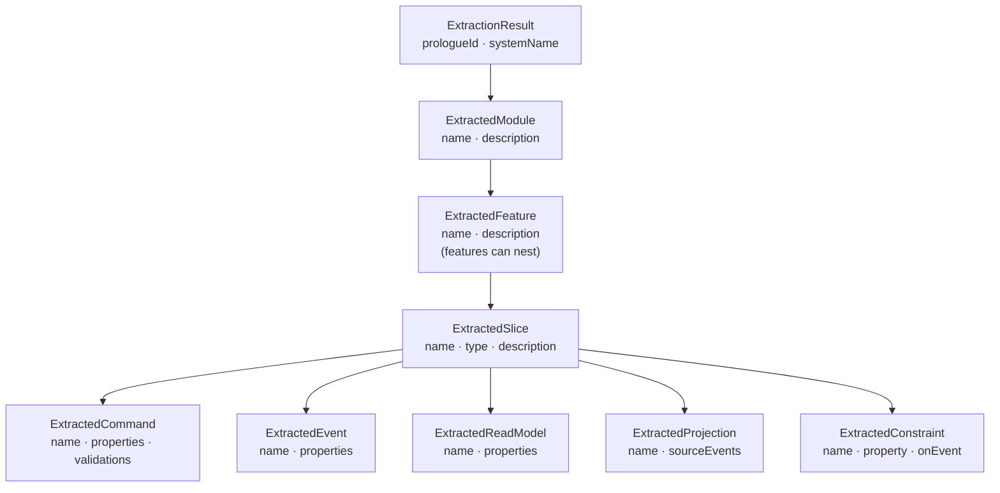

The Interpreter writes one JSON document, `extraction-result.json`, plus a generated [Screenplay](/screenplay/) `.play` file describing the same model in Screenplay's declarative language. This page documents the JSON shape; the `.play` file is what you'd hand-edit or run.

## Shape

## `ExtractionResult`

| Property | Type | Purpose |
|---|---|---|
| `prologueId` | `guid` | Which Prologue these captures belonged to |
| `systemName` | `string` | The system name — heuristic-derived, or set by LLM refinement |
| `modules` | array of `ExtractedModule` | The top-level structure the Interpreter inferred |

## `ExtractedModule`

| Property | Type | Purpose |
|---|---|---|
| `name` | `string` | Module name |
| `description` | `string` | Optional description |
| `features` | array of `ExtractedFeature` | Features within the module |

## `ExtractedFeature`

| Property | Type | Purpose |
|---|---|---|
| `name` | `string` | Feature name |
| `description` | `string` | Optional description |
| `subFeatures` | array of `ExtractedFeature` | Nested features, when the evidence groups naturally into sub-areas |
| `slices` | array of `ExtractedSlice` | Slices within the feature |

## `ExtractedSlice`

| Property | Type | Purpose |
|---|---|---|
| `name` | `string` | Slice name |
| `type` | `"StateChange"` \| `"StateView"` \| `"Automation"` \| `"Translation"` | Which of the four Cratis slice types the evidence matches |
| `description` | `string` | Optional description |
| `commands` | array of `ExtractedCommand` | At most one, for a `StateChange` slice |
| `events` | array of `ExtractedEvent` | The facts the slice produces |
| `readModels` | array of `ExtractedReadModel` | For a `StateView` slice |
| `projections` | array of `ExtractedProjection` | How read models are built from events |
| `constraints` | array of `ExtractedConstraint` | Uniqueness/invariant rules inferred from rejected requests |

`commands` is a list rather than a nullable single value — a `StateView`/`Automation`/`Translation` slice simply has an empty list, so the shape never carries a null.

## `ExtractedCommand`, `ExtractedEvent`, `ExtractedReadModel`

| Property | Type | Purpose |
|---|---|---|
| `name` | `string` | Type name |
| `description` | `string` | Optional description (commands only) |
| `properties` | array of `ExtractedProperty` | The fields on this type |
| `validations` | array of `ExtractedValidationRule` | Command-only — see below |

`ExtractedProperty`: `name`, `type`, `isRequired` (`bool`), `maxLength` (`int`, `0` when not applicable).

## `ExtractedProjection` and `ExtractedConstraint`

| Type | Properties |
|---|---|
| `ExtractedProjection` | `name`, `sourceEvents` (array of event type names the projection consumes) |
| `ExtractedConstraint` | `name`, `property`, `onEvent` (which event's property the constraint governs) |

## `ExtractedValidationRule`

| Property | Type | Purpose |
|---|---|---|
| `property` | `string` | Which command property the rule applies to |
| `kind` | `"Required"` \| `"MaxLength"` \| `"MinLength"` \| `"Pattern"` | The kind of validation the evidence implied |
| `argument` | `string` | The rule's argument (a length, a pattern) |
| `message` | `string` | The message associated with a rejection |

## What happens to it next

The generated `.play` file is a working starting point, not a finished model — [run it directly](/screenplay/) with `cratis run` to boot it as a local Stage sandbox, bring it into Studio to keep shaping it visually, or hand-edit the `.play` file itself, since Screenplay is meant to be authored by hand as much as generated.

## Next

- **[How Prologue works](../concepts.md)** — how the Interpreter derives this structure from captures.
- **[Screenplay](/screenplay/)** — the language this result compiles into.
