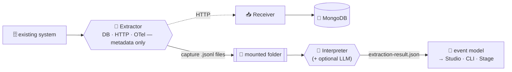

<div align="center">

# 📜 Cratis Prologue

**Captures what an existing system *actually does* — its HTTP commands, database changes, and telemetry — and interprets that into an event model Cratis can perform.**

[](https://discord.gg/kt4AMpV8WV)
[](https://hub.docker.com/r/cratis/prologue-extractor)
[](https://github.com/Cratis/Prologue/actions/workflows/dotnet-build.yml)
[](https://github.com/Cratis/Prologue/actions/workflows/publish.yml)
[](LICENSE)

</div>

---

Before the main action, a play has a **prologue** — the opening that recounts everything that happened before
the curtain rose. Cratis Prologue is that opening act for an existing system. It stands beside an existing, running application, captures what it *truly does* — SQL Server and Postgres changes, HTTP commands,
OpenTelemetry traces — and interprets those captures into an **event model** that can be brought into
[Cratis Studio](https://github.com/Cratis/Studio) or used from the Cratis CLI (and, from there, performed live
by **Stage**). It's how an existing system enters the Cratis story — by writing down the backstory it's been
telling all along.

It captures **metadata, not data**: which tables and columns changed, which endpoints were called, which spans
fired — never the actual values. The story, not anyone's private lines.

Prologue is self-contained: it has no dependency on Studio and does not require Orleans or any other hosting
model. Everything runs either as a downloadable CLI (the Extractor) or as containers (the Extractor,
Interpreter, and Receiver).

## 📜 Why "Prologue"?

Three reasons, and they all line up:

- **A prologue tells the backstory.** It recounts what happened before the play begins. Prologue captures the
  system that already exists — the story so far — before you model it in Cratis.
- **It comes first.** Its output is an event model — the script the rest of the cast performs. Prologue always
  opens the show: capture and interpret, then hand the model on.
- **The Cratis storytelling family.** Cratis names its products after telling a story: **Chronicle** records
  new events, **Arc** shapes the plot, **Screenplay** is the script, **Stage** performs it, **Studio**
  storyboards it… **Prologue** writes the opening act from a system that predates them all. It joins the cast.

## 🎥 From a running system to a script

The Extractor watches an existing system from a few angles at once, correlates what it sees into captures, and
the Interpreter reads those captures back into an event model:



- **Database change capture** — watches SQL Server (CDC) and Postgres (logical replication) and records, per
  transaction, which tables and columns changed.
- **HTTP command capture** — sits in front of the system as a YARP reverse proxy and records the `POST` /
  `PUT` / `DELETE` operations passing through.
- **OpenTelemetry capture** — acts as an OTLP proxy, capturing span metadata (and an allowlisted set of
  attributes) and forwarding the telemetry on unchanged.

The streams are correlated by a time-window heuristic and shared trace id — a command plus the database
transactions committed within its window become one **capture** — so the intent and the changes it caused are
read as a single act. The Interpreter then reconstructs those captures into an `ExtractionResult`: modules,
features, and slices with their commands, events, read models, and projections.

## 🎭 The cast (projects)

| Project | Package / Image | Purpose |
|---|---|---|
| `Source/Contracts` | `Cratis.Prologue.Contracts` (NuGet) | The capture contract — `Capture`, `Observation`, payload types, and the canonical JSON (`CaptureSerialization`) and capture-file (`CaptureFiles`) formats. |
| `Source/Configuration` | `Cratis.Prologue.Configuration` (NuGet) | Well-defined configuration types for `cratis-prologue.json` plus serialization helpers to read and write it. |
| `Source/Storage` | `Cratis.Prologue.Storage` (NuGet) | MongoDB persistence of captures — used by the Receiver and by consumers such as Studio. |
| `Source/Extractor` | `cratis/prologue-extractor` (Docker) | Runs next to the system being captured. Captures SQL Server CDC, Postgres logical replication, HTTP commands (reverse proxy), and OpenTelemetry — writes capture files or posts to the Receiver. |
| `Source/Interpreter.Contracts` | `Cratis.Prologue.Interpreter.Contracts` (NuGet) | The extraction result contract — `ExtractionResult` and the `Extracted*` model tree, plus serialization helpers for the result file. |
| `Source/Interpreter` | `cratis/prologue-interpreter` (Docker) | Run-to-completion job that reads capture files from a mounted folder, interprets them into an event model, and writes the extraction result to a mounted output folder. |
| `Source/Receiver` | `cratis/prologue-receiver` (Docker) | HTTP endpoint the Extractor can post captures to directly, instead of capturing to file. |

## ⚙️ Configuration — `cratis-prologue.json`

All tools are configured with a dedicated `cratis-prologue.json` file — not `appsettings.json`. The
`Cratis.Prologue.Configuration` package contains the configuration types and does the serialization, so any
consumer (Studio, the CLI, or your own tooling) can write configuration files in the exact format the tools
expect.

```json
{
    "prologue": {
        "output": { "kind": "Json", "json": { "directory": "./captures" } },
        "correlation": { "windowMilliseconds": 2000 },
        "sqlServer": [ { "name": "main", "connectionString": "..." } ],
        "postgres": [],
        "openTelemetry": { "enabled": true }
    },
    "llm": {
        "enabled": true,
        "kind": "Anthropic",
        "accessToken": "sk-...",
        "modelId": "claude-opus-4-6"
    }
}
```

- The **Extractor** looks for `cratis-prologue.json` in its working directory (override with the
  `PROLOGUE_CONFIG` environment variable) and binds the `prologue` section.
- **The file is the baseline; environment variables override it.** A deployed tool is configured by its host — a
  container, an orchestrator, or an Aspire composition — so any setting can be supplied in the usual
  double-underscore form (`Prologue__Output__Kind`, `Prologue__SqlServer__0__ConnectionString`,
  `ReverseProxy__Clusters__monitored__Destinations__primary__Address`). Use `AddPrologueConfiguration()` from
  `Cratis.Prologue.Configuration` to get that precedence right in your own host.
- The **Interpreter** reads the same file (mounted into its container at `/config/cratis-prologue.json`) and
  binds the `llm` section for optional LLM-based refinement. Supported `kind` values: `Ollama` (default, native
  chat API), `OpenAI`, `AzureOpenAI` (the `modelId` is the deployment name), `OpenAICompatible` (any `/v1`
  endpoint), and `Anthropic` — each configured with an `endpoint` and an `accessToken` as needed; the hosted
  providers default to their public endpoints and models.

## 🎟️ Data flow

```text
Extractor ──(capture .jsonl files)──▶ mounted folder ──▶ Interpreter ──▶ extraction result .json
    └──────(HTTP)──▶ Receiver ──▶ MongoDB
```

The Extractor emits one `CapturedEntry` per line (JSON lines), partitioned per source kind. The Interpreter
reads a folder of those files, reconstructs the correlated captures, and produces an `ExtractionResult`.

## 📚 Seeing it work — the Library sample

[`Samples/Library`](Samples/Library) is a complete, ordinary ASP.NET + Entity Framework Core system — a library
with authors, members, a catalog, inventory, reservations, and lending — built with **no Cratis constructs at
all**, exactly the kind of system Prologue gets pointed at. Its Aspire composition wires the whole capture
pipeline around it and can generate realistic load on demand:

```shell
cd Samples/Library
aspire run                        # PostgreSQL
aspire run -- --database mssql    # SQL Server
```

Then use the **Simulate load** command on the `core` resource in the Aspire dashboard and watch captures land in
MongoDB. All three capture sources are live: HTTP commands through the reverse proxy, database changes through
CDC or logical replication, and OpenTelemetry traces, metrics, and logs. See the
[sample's README](Samples/Library/README.md) for the details.

## 🚀 Building

```shell
dotnet build                # Debug — includes inline specs
dotnet test                 # run the specs (Debug only — Release strips them)
dotnet build -c Release     # Release — warnings are errors
```

> The inline specs are compiled only in Debug, so run `dotnet test` in Debug. The Library sample's integration
> tests need Docker and browsers and are excluded with `--filter "Category!=Integration"`.

Container images are built from the repository root:

```shell
docker build -f Source/Extractor/Dockerfile   -t cratis/prologue-extractor .
docker build -f Source/Interpreter/Dockerfile -t cratis/prologue-interpreter .
docker build -f Source/Receiver/Dockerfile    -t cratis/prologue-receiver .
```

## ✅ Quality gates

```shell
dotnet build -c Release     # zero warnings, zero errors
dotnet test                 # all specs green
```

---

<div align="center">

*Part of the [Cratis](https://cratis.io) platform · Licensed under the [MIT license](LICENSE)*

</div>
