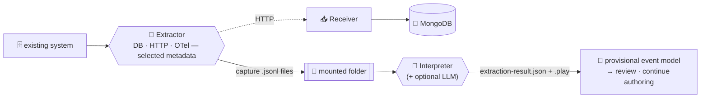

<div align="center">

# 📜 Cratis Prologue

**Captures selected signals from an existing system — HTTP commands, database changes, and telemetry — and interprets them into a provisional event model for review.**

[](https://discord.gg/kt4AMpV8WV)
[](https://hub.docker.com/r/cratis/prologue-extractor)
[](https://github.com/Cratis/Prologue/actions/workflows/dotnet-build.yml)
[](https://github.com/Cratis/Prologue/actions/workflows/publish.yml)
[](LICENSE)

</div>

---

Before the main action, a play has a **prologue** — the opening that recounts everything that happened before
the curtain rose. Cratis Prologue is that opening act for an existing system. It stands beside an existing,
running application, captures selected SQL Server and PostgreSQL changes, HTTP commands, and OpenTelemetry
signals, and uses that evidence to propose an **event model**. The result can be reviewed and continued as a
Cratis Screenplay rather than treated as recovered domain truth.

Prologue is **experimental** and part of the early-development Cratis model-first layer. The event model it
proposes is a starting point for building an event-sourced system with Cratis — event sourcing with
[Chronicle](https://github.com/Cratis/Chronicle) recording what happens and [Arc](https://github.com/Cratis/Arc)
exposing typed commands and queries.

Prologue captures structural and operational metadata rather than database row values or HTTP bodies. Some
metadata can still be sensitive: HTTP observations include query strings, telemetry contains identifiers and
names, and explicitly allowlisted OpenTelemetry attributes include their values. Minimize and review the capture
configuration, and protect capture files and persisted observations accordingly.

Prologue has no dependency on Studio. The Extractor, Receiver, and batch Interpreter run without Orleans. The
Interpreter's optional resumable service mode embeds an Orleans silo for persisted session grains; consumers that
only need file-based interpretation do not use that mode.

## 📜 Why "Prologue"?

Three reasons, and they all line up:

- **A prologue tells the backstory.** It recounts what happened before the play begins. Prologue captures the
  system that already exists — the story so far — before you model it in Cratis.
- **It comes first.** Its output is an event model — the script the rest of the cast performs. Prologue always
  opens the show: capture and interpret, then hand the model on.
- **The Cratis storytelling family.** Cratis names its products after telling a story:
  **[Chronicle](https://github.com/Cratis/Chronicle)** records new events,
  **[Arc](https://github.com/Cratis/Arc)** shapes the plot,
  **[Screenplay](https://github.com/Cratis/Screenplay)** is the script,
  **[Stage](https://github.com/Cratis/Stage)** performs it,
  **[Studio](https://github.com/Cratis/Studio)** storyboards it… **Prologue** writes the opening act from a
  system that predates them all. It joins the cast.

## 🎥 From a running system to a script

The Extractor watches an existing system from a few angles at once, correlates what it sees into captures, and
the Interpreter reads those captures back into an event model:


```mermaid
flowchart LR
    Sys["🗄️ existing system"] --> Ext{{"📜 Extractor<br/>DB · HTTP · OTel — selected metadata"}}
    Ext -->|"capture .jsonl files"| Folder[["📁 mounted folder"]]
    Ext -.->|"HTTP"| Rcv["📥 Receiver"] --> Mongo[("🍃 MongoDB")]
    Folder --> Interp{{"🧠 Interpreter<br/>(+ optional LLM)"}}
    Interp -->|"extraction-result.json + .play"| Model["📄 provisional event model<br/>→ review · continue authoring"]
```

- **Database change capture** — watches SQL Server (CDC) and Postgres (logical replication) and records, per
  transaction, which tables and columns changed.
- **HTTP command capture** — sits in front of the system as a YARP reverse proxy and records the `POST` /
  `PUT` / `DELETE` operations passing through.
- **OpenTelemetry capture** — acts as an OTLP proxy, capturing span metadata (and an allowlisted set of
  attributes) and forwarding the telemetry on unchanged.

The streams are correlated by a time-window heuristic and shared trace id — a command plus database transactions
committed within its window become one **capture**. Because timing and trace evidence can be incomplete, that
relationship is provisional. The Interpreter analyzes the captures into an `ExtractionResult`: candidate modules,
features, and slices with commands, events, read models, and projections.

## 🎭 The cast (projects)

| Project | Package / Image | Purpose |
|---|---|---|
| `Source/Contracts` | `Cratis.Prologue.Contracts` (NuGet) | The capture contract — `Capture`, `Observation`, payload types, and the canonical JSON (`CaptureSerialization`) and capture-file (`CaptureFiles`) formats. |
| `Source/Configuration` | `Cratis.Prologue.Configuration` (NuGet) | Configuration types and loading helpers for the Extractor and Interpreter's `cratis-prologue.json`. |
| `Source/Storage` | `Cratis.Prologue.Storage` (NuGet) | MongoDB persistence of captures — used by the Receiver and by consumers such as Studio. |
| `Source/Extractor` | `cratis/prologue-extractor` (Docker) | Runs next to the system being captured. Captures SQL Server CDC, Postgres logical replication, HTTP commands (reverse proxy), and OpenTelemetry — writes capture files or posts to the Receiver. |
| `Source/Interpreter.Contracts` | `Cratis.Prologue.Interpreter.Contracts` (NuGet) | The extraction result contract — `ExtractionResult` and the `Extracted*` model tree, plus serialization helpers for the result file. |
| `Source/Interpretation` | `Cratis.Prologue.Interpretation` (NuGet) | Deterministic heuristic model construction plus optional language-model refinement. |
| `Source/Screenplay` | `Cratis.Prologue.Screenplay` (NuGet) | Converts an `ExtractionResult` into a Screenplay syntax tree and `.play` document. |
| `Source/Interpreter` | `cratis/prologue-interpreter` (Docker) | Batch interpretation from capture files, or an optional Orleans-backed resumable HTTP service using MongoDB. |
| `Source/Receiver` | `cratis/prologue-receiver` (Docker) | HTTP endpoint the Extractor can post captures to directly, instead of capturing to file. |

## ⚙️ Configuration — `cratis-prologue.json`

The Extractor and Interpreter use a dedicated `cratis-prologue.json` file. The
`Cratis.Prologue.Configuration` package contains their configuration types and loading helpers, so a consumer can
write the format those tools expect. The Receiver uses standard ASP.NET configuration for its MongoDB settings.

```json
{
    "prologue": {
        "output": { "kind": "Json", "json": { "directory": "./captures" } },
        "correlation": { "windowMilliseconds": 2000 },
        "sqlServer": [ { "name": "main", "connectionString": "..." } ],
        "postgres": [],
        "openTelemetry": { "enabled": true }
    },
    "llm": {
        "enabled": true,
        "kind": "Anthropic",
        "accessToken": "sk-...",
        "modelId": "claude-opus-4-6"
    }
}
```

- The **Extractor** looks for `cratis-prologue.json` in its working directory (override with the
  `PROLOGUE_CONFIG` environment variable) and binds the `prologue` section.
- **The file is the baseline; environment variables override it.** A deployed tool is configured by its host — a
  container, an orchestrator, or an Aspire composition — so any setting can be supplied in the usual
  double-underscore form (`Prologue__Output__Kind`, `Prologue__SqlServer__0__ConnectionString`,
  `ReverseProxy__Clusters__monitored__Destinations__primary__Address`). Use `AddPrologueConfiguration()` from
  `Cratis.Prologue.Configuration` to get that precedence right in your own host.
- The **Interpreter** reads the same file (mounted into its container at `/config/cratis-prologue.json`) and
  binds the `llm` section for optional LLM-based refinement. Supported `kind` values: `Ollama` (default, native
  chat API), `OpenAI`, `AzureOpenAI` (the `modelId` is the deployment name), `OpenAICompatible` (any `/v1`
  endpoint), and `Anthropic` — each configured with an `endpoint` and an `accessToken` as needed; the hosted
  providers default to their public endpoints and models.

## 🎟️ Data flow

```text
Extractor ──(capture .jsonl files)──▶ mounted folder ──▶ Interpreter ──▶ extraction result .json
    └──────(HTTP)──▶ Receiver ──▶ MongoDB
```

The Extractor emits one `CapturedEntry` per line (JSON lines), partitioned per source kind. The Interpreter
reads a folder of those files, analyzes the correlated captures, and produces an `ExtractionResult` and a
Screenplay `.play` document.

## 📚 Seeing it work — the Library sample

[`Samples/Library`](Samples/Library) is a complete, ordinary ASP.NET + Entity Framework Core system — a library
with authors, members, a catalog, inventory, reservations, and lending — built with **no Cratis constructs at
all**, exactly the kind of system Prologue gets pointed at. Its Aspire composition wires the whole capture
pipeline around it and can generate realistic load on demand:

```shell
cd Samples/Library
aspire run                        # PostgreSQL
aspire run -- --database mssql    # SQL Server
```

Then use the **Simulate load** command on the `core` resource in the Aspire dashboard and watch captures land in
MongoDB. All three capture sources are live: HTTP commands through the reverse proxy, database changes through
CDC or logical replication, and OpenTelemetry traces, metrics, and logs. See the
[sample's README](Samples/Library/README.md) for the details.

## 🚀 Building

```shell
dotnet build                # Debug — includes inline specs
dotnet test                 # run the specs (Debug only — Release strips them)
dotnet build -c Release     # Release — warnings are errors
```

> The inline specs are compiled only in Debug, so run `dotnet test` in Debug. The Library sample's integration
> tests need Docker and browsers and are excluded with `--filter "Category!=Integration"`.

Container images are built from the repository root:

```shell
docker build -f Source/Extractor/Dockerfile   -t cratis/prologue-extractor .
docker build -f Source/Interpreter/Dockerfile -t cratis/prologue-interpreter .
docker build -f Source/Receiver/Dockerfile    -t cratis/prologue-receiver .
```

## ✅ Quality gates

```shell
dotnet build -c Release     # zero warnings, zero errors
dotnet test                 # all specs green
```

## The Cratis ecosystem

This project is part of [Cratis](https://www.cratis.io) — free, MIT-licensed tools for building event-sourced
and CQRS applications.

- **[Chronicle](https://github.com/Cratis/Chronicle)** — event-sourcing database and runtime. Orleans-based kernel, pluggable storage (MongoDB default; PostgreSQL, SQL Server, SQLite, in-memory), language-agnostic gRPC contracts. [Docs](https://www.cratis.io/chronicle/)
- **Chronicle clients** — first-class [.NET SDK](https://github.com/Cratis/Chronicle), plus [TypeScript](https://github.com/Cratis/Chronicle.TypeScript), [Kotlin/Java](https://github.com/Cratis/Chronicle.Kotlin), and [Elixir](https://github.com/Cratis/Chronicle.Elixir); [Python](https://github.com/Cratis/Chronicle.Python) coming soon (pre-alpha). AI agents connect through the [Chronicle MCP server](https://github.com/Cratis/Chronicle.Mcp).
- **[Arc](https://github.com/Cratis/Arc)** — opinionated CQRS framework for ASP.NET Core with commands, queries, validation, authorization, and TypeScript proxy generation. Works without event sourcing. [Docs](https://www.cratis.io/arc/)
- **[Components](https://github.com/Cratis/Components)** — React components aligned with Arc patterns. [Docs](https://www.cratis.io/components/)
- **[CLI](https://github.com/Cratis/cli) + Workbench** — inspect and diagnose Chronicle from the terminal or the browser. [Docs](https://www.cratis.io/cli/)
- **Model-first layer (experimental)** — [Studio](https://github.com/Cratis/Studio), [Screenplay](https://github.com/Cratis/Screenplay), [Stage](https://github.com/Cratis/Stage), [Scene](https://github.com/Cratis/Scene), and Prologue (this repository)
- **Supporting** — [Fundamentals](https://github.com/Cratis/Fundamentals), [Specifications](https://github.com/Cratis/Specifications), [Synopsis](https://github.com/Cratis/Synopsis), [Lens](https://github.com/Cratis/Lens), [Narrator](https://github.com/Cratis/Narrator), and free [AI tooling](https://github.com/Cratis/AI) (preview); [Ensemble](https://github.com/Cratis/Ensemble) coming soon (pre-release)
- **[Samples](https://github.com/Cratis/Samples)** — runnable event sourcing and CQRS samples for the whole stack

Everything Cratis publishes today is MIT licensed and free to use. Come talk with us on
[Discord](https://discord.gg/kt4AMpV8WV).

---

<div align="center">

*Part of the [Cratis](https://cratis.io) platform · Licensed under the [MIT license](LICENSE)*

</div>
